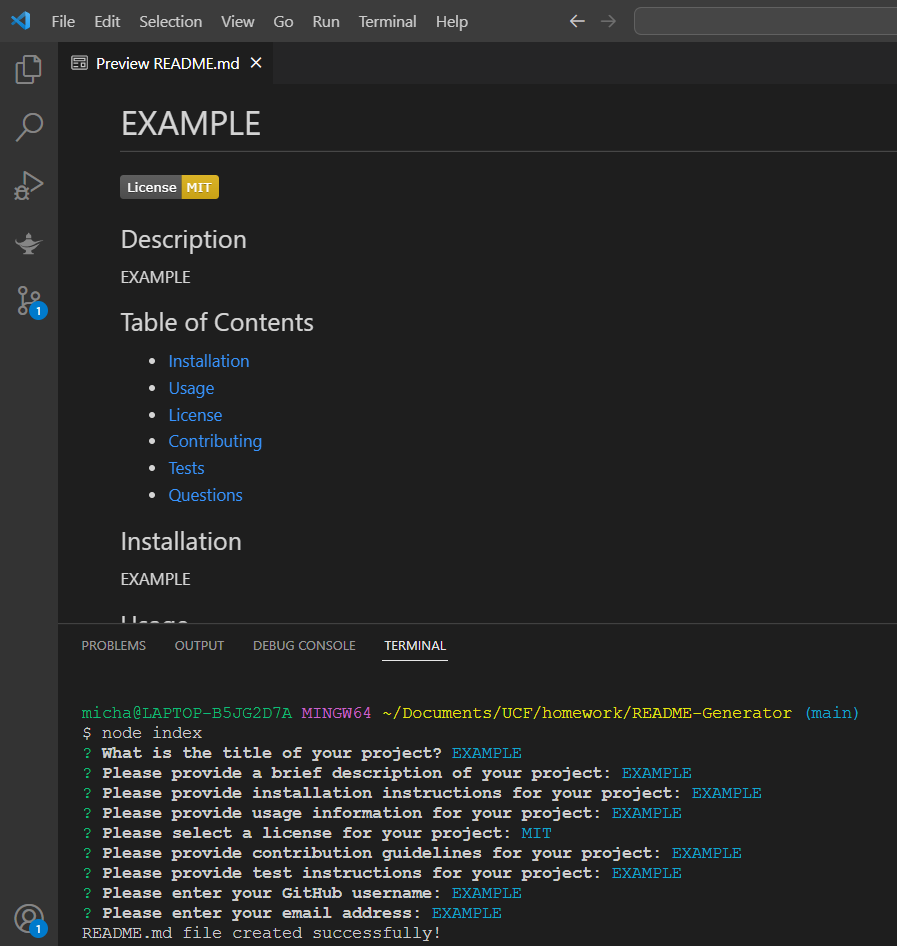

# README GENERATOR

## Description

This application simplifies the process of creating a high quality README by asking the user a series of questions in a prompt. The application then takes the answers and creates a markdown file utilizing them.

## Table of Contents

- [Installation](#installation)
- [Usage](#usage)
- [License](#license)
- [Contributing](#contributing)
- [Tests](#tests)
- [Questions](#questions)

## Installation

Clone the repo to your device.

## Usage

Open the integrated terminal in VS Code and type "node index.js" to start the prompt.
[Click here for video!](https://drive.google.com/file/d/1I5vJvrhWvNwRZLLlH4IOVWRa8Q9WiGPX/view)

## License

This project is covered under the MIT license.

## Contributing

N/A

## Tests

N/A

## Questions

If you have any questions or would like to contribute to this project, please contact me at [michaelmcleod133@gmail.com](mailto:michaelmcleod133@gmail.com). You can also find more of my work on [GitHub](https://github.com/ChemicalModel/).
  